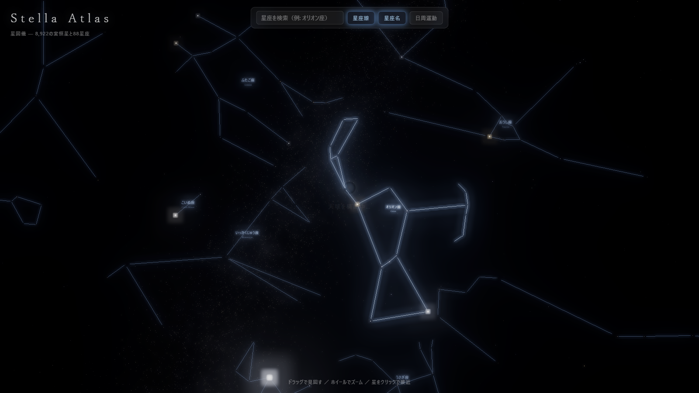

# Stella Atlas — 星図儀

実在の天文データに基づく3Dプラネタリウム。ブラウザで星空を見回し、星をクリックすると恒星へ没入フライトする。



## 特徴

- **実データ**: [HYG Database](https://github.com/astronexus/HYG-Database) の8,922恒星（視等級6.5以下）を正確な位置・等級・色（B-V色指数→色温度）で描画
- **88星座**: [Stellarium](https://github.com/Stellarium/stellarium) の星座線定義を使用。日本語名表示・検索対応
- **没入フライト**: 星をクリックするとカメラが飛行。恒星表面はノイズベースの粒状斑・黒点・周縁減光をGLSLで表現
- **天の川**: 銀河座標系に沿った約6万パーティクル（銀河中心バルジ付き）
- **日周運動**: 天の北極を軸にした自転シミュレーション

## 開発

```bash
npm install
npm run fetch-data   # 初回のみ: HYG + Stellarium データを取得・変換
npm run dev
```

`npm run build` で `dist/` に静的ビルド（変換済みデータは `public/data/` にコミット済みのため、ビルドだけならfetch-data不要）。

## 技術

Vite + TypeScript + Three.js。星はカスタムシェーダのポイントスプライト（等級→サイズ/輝度、回折スパイク、シンチレーション）、UnrealBloomPassで発光。
